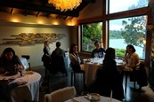

CORDEIRO PATAGÔNICO: O melhor lugar fica no km 14 da av Bustillo: RINCON PATAGÔNICO, um lugar para saborear, desfrutar e viver Bariloche e sua belíssima gastronomia. (Mas o custo de um remise = taxi = é um pouco alto para ir e voltar) 
Outra opção seria no km 7: EL PATACÓN também super recomendado só que prepare seu bolso! Eh bem caro este restaurante! 
E no centro, para quem tem mais pressa e nenhuma vontade de se amarrar com taxis o indicado é comer no La Casita que é bem gostoso também!! Além de aconchegante!!

•       Conheça o famoso EL BOLICHE DE ALBERTO CARNES (Calle Elflein, 158 - Villegas, 347) – a melhor “parrilla” (CHURRASCARIA) da região, com certificação de excelência. Cuidado com o tamanho da porção de batata frita! Dá para 4 pessoas! É enorme! (aliás a salada, o arroz e o pure ídem!) Logicamente acompanhados de um saborosíssimo BIFE DE CHORIZO (contra filé) ou OJO DE BIFE (peça apenas 1 bife aberto em MARIPOSA – virão 2 bifões – veja abaixo) ah, e se gostar de queijo, peça uma PROVOLETA de entrada! O Chimichurri deles (molhinho de entrada) é EXCEPCIONAL!

{: .align-center} 
{: .align-center} 
{: .align-center} 

•	Uma das casas mais populares e tradicionais de carne entre a população de Bariloche é o LAS BRASAS quase em frente ao boliche de Alberto da Rua Elflein mas vai aqui uma dica de Gordo Curioso: peça meia porção de uma glândula de nome MOLLEJA (fala-se “mojerra”) com limão, INESQUECÍVEL! Muito macia e saborosa e lembre-se que GLÂNDULAS não são VÍCERAS (tripas etc)! Confie em mim e saboreie esta delicia no Las Brasas (e olha que eu sou nojenta!!!). São deliciosasss as mollejas argentinas!!! (não esqueça do LIMÃO).

•	Outra famosa churrascaria : LA PARRILLA DE JULIÁN,  em 2 endereços: Av.San Martin, 590 (o mais antigo) e Mitre (ao lado da Galeria do Sol). O Lomo e o Bife de chorizo são simplesmente UMA MANTEIGA... deliciosos! 

•	MASSA:

-	TRATORIA I’ITALIANO (Calle Quaglia, 219)
-	EL BOLICHE DE ALBERTO PASTAS (Calle Elflein 147 – quase em frente ao de Carnes)
DICA: A lasagna é gigante (dá pra 2 pessoas) peça para ser cortada ainda na cozinha na foto abaixo no primeiro prato ela INTEIRA e no segundo a METADE da lasagna.

{: .align-center} 
{: .align-center} 

ATENÇÃO para: NHOQUI RELLENO (nhoque recheado com mozzarela!!!!)  SORRENTINO de calabaza (o famoso tortelle de abóbora) e CANELONI (pra 2 pessoas).
De sobremesa peça MEIA “copa” (de Alberto): Sorvete de creme, doce de leite, framboesas e chantilly (affe! Inesquecívelmente OBESO E TENTADOR!!!!) 
Dá para duas pessoas! Divida!!

{: .align-center} 
{: .align-center}
{: .align-center} 

Um dos restaurante mais tradicionais de Bariloche é o FAMILIA WEISS (esquina da Calle Palacios com Calle O’Connor) onde se pode saborear a famosíssima TRUCHA (TRUTA) barilochense, seu carro chefe. 
Fino e elegante, muitas vezes faz apresentações musicais ao vivo. 
É um dos restaurantes mais ˝indicados˝ de Bariloche (pela revista Viagem).
Eu particularmente não o prefiro.
EVITE COMER CARNE NESTE LOCAL – só tive queixas nos ultimos 4 anos!!!! (Massas ou trucha) e vá preparado para ser bem atendido ou ˝não tanto˝ (dependerá muito da lua do Garçom que te atender #FATO.

•     FONDUE:

•     LA MARMITE Rua Mitre, 347 com ambiente aconchegante e atendimento primoroso, é a casa mais conhecida devido a revista Viagem e 4 Rodas (não é o meu preferido e tem muita fila) mas é bom. Apresenta pratos variados além do Fondue.

•     LA CASITA Rua Quaglia, 342 (antigo CASITA SUIZA), apresenta além do divino fondue de queijo com 8 guarnições também o fondue de carne com molhos variados (ATENÇÃO: não é frito no óleo e sim cozido em um caldo de carne – geralmente esta forma de cozinhar a carne NAO AGRADA AO PALADAR BRASILEIRO). 
Muito recomendado tambem o famoso cordeiro patagônico citado acima.
Informe-se também sobre a tábua de três carnes para duas pessoas e o espetacular arroz de montanha (muito parecido com a paella porém elaborado com carnes patagônicas).  Ambiente romântico e aconchegante. Atendimento primoroso.

{: .align-center} 

As fotos a seguir mostram o Fondue de carne e o espetacular crepe de mousse de Limao (morninho) com Frutos vermelhos (FRUTOS ROJOS) ---- pensa numa coisa BOA!!!! Ah! e falando em nome da agência: VANESSA OLIVATTI vocês terão grátis UMA TACINHA DE LICOR para finalizar o jantar!  Mmmmmmmmmm Saúde!

{: .align-center} 
{: .align-center} 

•	CHEZ PHILIPPE (meu preferido!!!) é a opção mais exclusiva e diferenciada para o fondue, uma das melhores atenções e cozinhas de Bariloche, há mais de 20 anos na cidade. Ideal para casais por estar mais distanciado do centro da cidade (de todas maneiras apenas 1 km do centro) Trata-se de um restaurante gourmet, pequeno, com capacidade máxima para 26 pessoas, muito agradável e só atende com reservas. 
Calle Primera Junta, 1080 – Fone: 442-7291.  

{: .align-center} 
{: .align-center} 

•	MEXICANO Calle Morales, 362. Aberto em 1999 e atendido por mexicanos. Único restaurante de Bariloche que serve a culinaria mexicana.

•	COMIDAS RÁPIDAS: ROCK CHICKEN é um restaurante muito popular onde você poderá degustar de milanesas de frango IMENSAS no prato acompanhados de purê ou carnes (menos elaboradas e mais populares) e fica na Av San Martin,324 - próximo ao Willkeny. Não é um lugar CHIC. É apenas rápido, econômico E ABASTADO!!!

•	SANDUICHES: Mostaza (Mitre alt. n25 e Shopping) CHIMI Bar (tem um Choripan maravilhoso! (Elflein 73) e MAC DONALDS (Mitre alt. 130). 
Não recomendo: La Casa de La Hamburguesa! (o lugar é tomado pela gordura da fritura. Horrível! Atendimento péssimo e demorado!)

•	BUTTERFLY (Calle HuaHuam 7831 - Av. Bustillo km 7,9 – Playa Bonita) 
Fone: 446-1441. Restaurante gourmet com menu degustação de 7 passos (somente com reservas). Finíssimo, ambiente elegante e íntimo. Aberto somente à noite. Não atende aos domingos.  E-mail: contacto@butterflypatagonia.com.ar

{: .align-center} 
{: .align-center} 

CASSIS (Ruta 82, Lago Gutiérrez, Peñón de Arelauquen) Fone: 4476167 Restaurante gourmet com sabores da Patagônia – Menu degustação de 7 passos (somente com reservas). Fechado aos domingos. Finíssimo no mesmo estilo do Butterfly – Elegante e íntimo. Nao recomenda-se levar crianças.

{: .align-center} 
{: .align-center} 

ALTO EL FUEGO – 20 de febrero, 451 - logo acima do Centro Cívico a direita do Clube Andino. 
Vem disputando com o El Boliche de Alberto quem tem a melhor parrilla nos últimos 3 anos... 
Recomenda-se principalmente o bife de chorizo e o ojo de bife, além da provoleta, claro.
Vastíssima carta de vinhos (para todos os gostos e bolsos!) 
Muitíssimo bem recomendado pelo trip Advisor... 
É singular em sua atenção ao cliente, pequeno, aconchegante e atende somente com reservas (ao contrário do seu concorrente): 443 7015 / whatsapp: +5492944151409.

•	CERVEJARIAS: BLEST e MANUCH (ambas lado a lado na av Bustillo, km 4), e no centro (também lado a lado) BLEST E MANUCH (Calle Neumeyer 120 e 134) – sim! 
É guerra de gigantes nestes 2 casos! 
Além destas destacam-se ANTARES (Calle Elflein, 47), BACHMANN (Calle Elflein 90 e Calle Vice almirante O’Connor, 1348 e outras como RUTA 40, VICKINGO, SANTINO e a SENSACIONAL CERVEJARIA PATAGONIA (Bustillo, km 26,5 – Punto Panorâmico) – o maior problema desta cervejaria é a distância!
Se você ama cerveja, lúpulos e histórias sobre esta arte, não se esqueça de adicionar no seu roteiro o BEER EXPERIENCE! Que além da Cervejaria Patagônia, você visita as peculiares Wesley e Gilbert (esta é absurdamente fofa!) imperdível esse passeio!
Falaremos mais abaixo sobre ele! 
Proximo a Manush e Antares tem infinitas cervejarias menores... se você curte cerveja artesanal – O PONTO DE PARTIDA É O CLUB ANDINO BARILOCHE – ao lado tem muuuuuuitas cervejarias entre outras as citadas acima.

•	BELLEVUE SALAO DE CHÁ & QUEIJO, PAO E VINHO – Av. Bustillo, 24.600.  Simplesmente encantador!!!  Paisagem de calendário. Ambiente agradável e acolhedor. Atendido pelos próprios proprietários. Chocolate quente, chás, tortas de qualidade. Não abre as tercas-feiras x motivo familiar. Bemmm distante! Mas caso voce tenha uma tarde livre o local abre das 16 as 19 hs.  Se nao quiser pagar uma fortuna em taxi, voce podera ir ate o km 24.600 da Av Bustillo em onibus e adentrar – CAMINHANDO – uns 800 metros do lado oposto a pista... estrada de TERRA... existem placas sinalizando o local.
É praticamente uma pintura de MONET na sua frente.... ALUCINANTE PAISAGEM!

{: .align-center} 
{: .align-center} 
{: .align-center} 

CHÁ DA TARDE NO HOTEL LLAO LLAO 
O mais antigo e tradicional hotel de Bariloche oferece a oportunidade de um “Chá da Tarde” colonial, a partir das 16 até 19 h.  Há necessidade de reservas pelo telefone 444 8530 ou por e-mail: reservations@llaollao.com.ar   
Respondendo a famosa pergunta:  INFELIZMENTE NAO DA PRA CHEGAR DO PASSEIO DE BARCO ILHA VICTORIA E IR PARA O LLAO LLAO pois o barco chega as 18:45 no Porto e o Llao LLao termina de servir o chá as 19:00 hs, portanto apenas serão atendidos os que cheguem ou as 16 ou as 17 hs no local. 

•	Se você quer o famoso BBB, vá ao LA FUNDA DEL TIO - Rua Mitre, 1130. 
Peça diretamente, sem pestanejar, a MILANESA NAPOLITANA GIGANTE que dá fácil para 3 pessoas!!! 
Acompanhe com purê, batata frita ou arroz e sinta que AINDA EXISTE TEMPERO EM BARILOCHE!!! 
De segunda a sábado (não abre NUNCA aos domingos) e o nativo de Bariloche LOTA DIARIAMENTE O LOCAL!!! 
Chegue até as 20h15 ou espere em pé do lado de fora do local!! 
Vale a pena! Muito simples o local, porém bem saborosa a comida!! O famoso PÉ SUJO, SUJINHO do Brasil. Nao espere LUXO! Mas hiper recomendo essa Big Napolitana! 

{: .align-center} 
{: .align-center} 

